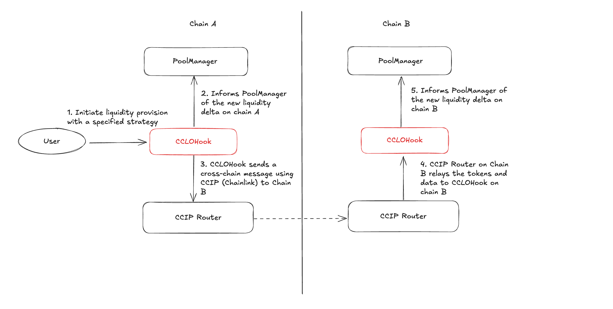
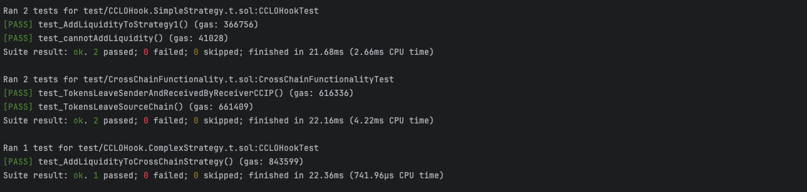

# Cross-Chain Liquidity Operator (CCLO)

A simple way to add liquidity to Uniswap V4 pools on multiple chains using Uniswap v4 hooks and Chainlink's CCIP.

## Why CCLO?

### Liquidity is fragmented

- With the rise of L2s such as Arbitrum, Optimism, and more, users are moving their funds across a multitude of chains to explore and use different applications.
- This introduces large amounts of liquidity fragmentation, where doing a swap on a particular chain can introduce large amounts of slippage.
- This is bad for users because they feel locked into chains once they have shifted their liquidity around. Frequent bridging introduces vulnerability to smart contract hacks and make an unpleasant experience.
- This bad for developers because developing on chains with lesser liquidity can mean lesser users because users tend to follow where the liquidity is best.

### We can fix this problem with chain abstraction over Uniswap v4 and Chainlink's CCIP

- Uniswap v4 introduces hooks where we can run arbitrary logic before and after different actions such as a swap, or modification of liquidity.
- CCLO is a hook contract designed to allow chain abstraction and greater sharing of liquidity across chains by providing a seamless integration of multiple chains behind the scenes.

**Users can provide liquidity across multiple chains simply by interacting with a single hook contract on one chain.
CCLO is designed to work seamlessly with two or more chains. When a user adds liquidity from one chain, it's automatically distributed to other connected chains based on the specified strategy. This multi-chain capability allows for flexible and efficient liquidity management across various blockchain networks**

## CCLO Architecture



## Example sequence

### 1. User Initiates Liquidity Provision:
- A user interacts with the CCLO hook on Chain A (e.g., Sepolia) to add liquidity.
- The user specifies the total amount of liquidity and the desired distribution across chains (e.g., 40% on Chain A, 60% on Chain B).
### 2. CCLO Processes the Request:
- The CCLO hook on Chain A receives the request and tokens from the user.
- It calculates the amount of liquidity to be added locally and the amount to be sent cross-chain.
### 3. Local Liquidity Addition:
- The CCLO hook adds the designated portion of liquidity to the local Uniswap V4 pool on Chain A.
### 4. Cross-Chain Liquidity Transfer:
- For the remaining liquidity, the CCLO hook prepares a cross-chain message using Chainlink's CCIP.
- This message includes details such as token addresses, amounts, and pool parameters.
### 5. CCIP Message Transmission:
- The CCIP router on Chain A sends the message to Chain B (e.g., Base Goerli).
- The message, along with the tokens, is transmitted across chains.
### 6. Receiving on Destination Chain:
- The CCLO hook on Chain B receives the CCIP message.
- It extracts the liquidity details and tokens from the message.
### 7. Remote Liquidity Addition:
- The CCLO hook on Chain B adds the received liquidity to the corresponding Uniswap V4 pool on Chain B.
### 8. Completion and Confirmation:
- The liquidity is now successfully split across both chains according to the user's specified strategy

## Tests
```
test
├── CCLOHook.ComplexStrategy.t.sol
├── CCLOHook.SimpleStrategy.t.sol
└── CrossChainFunctionality.t.sol
```

Tests are passing and each test files deals with a specific scenario and part of the hook.



## Deployment

### Hook Addresses

| Chain ID | Hook Address |
| -------- | ------------ |
| 84532    | 0x696907c68D922c289582dA6c35E4c49E3df44800 |
| 11155111 | 0x92A1Fd49D8A7e6ecf3414754257bBF7652750800 |

### Pool Ids


| Chain ID | Pool Id | Token0 | Token1 |
| -------- | ------- | ------ | ------ |
| 84532    | 0x7f19cbf62583730e067aeefeb4db801b382ab96579a77a223fc5f3e7738f72a2 | 0x036CbD53842c5426634e7929541eC2318f3dCF7e | 0x88A2d74F47a237a62e7A51cdDa67270CE381555e |
| 11155111 | 0x33736e913fc79be0466f7267344eb4fa5fa66d03c3562c8ccf6bd7f883c97146 | 0x1c7D4B196Cb0C7B01d743Fbc6116a902379C7238 | 0xFd57b4ddBf88a4e07fF4e34C487b99af2Fe82a05 |

### Deploying the Hook

To deploy the hook, you can use the `DeployCCLOHookTo{chain}.s.sol` scripts.

### Deploying the Pool

To deploy the pool, you can use the `AddPoolsTo{chain}.s.sol` scripts.

## Future Improvements

#### Just-in-time (JIT) liquidity provision for swaps:

- User makes a swap on chain A which does not have either 1) enough liquidity to support the swap or 2) non-optimal amount of liquidity (introduces large slippage)
- CCLO bridges over liquidity from other chains to pool together liquidity for the user to have a more optimal swap

#### Complex strategies for swaps and liquidity provision:

- Due to the time limitations of the hookathon, in our demo, we demonstrate the ability to provide liquidity in a fix split across 2 chains.
- More complex strategies for sharing liquidity can be adopted so users have a wider selection. Further, liquidity sharing can be more dynamic and actively balanced by others e.g. Eigenlayer AVS

#### Dynamic Strategies:

- Due to the time limitations of the hookathon, initially we planned to add AVS to add strategies to Hook based on the volume of the sibling pools.
- However, we realized that this is not possible due to the time limitations of the hookathon.

#### Removing Liquidity Cross-Chain:

- Currently, we are not able to remove liquidity cross-chain. Users can only remove liquidity on the chain they are on.